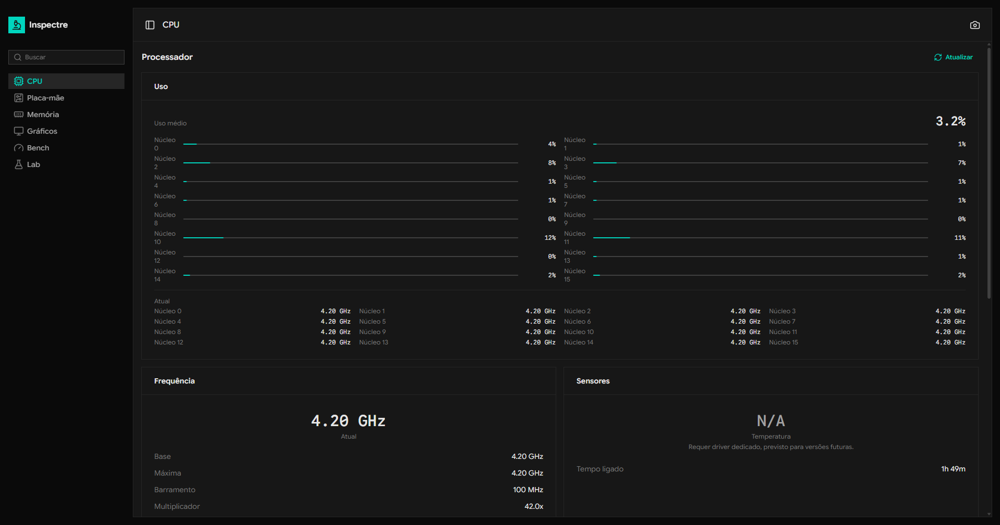
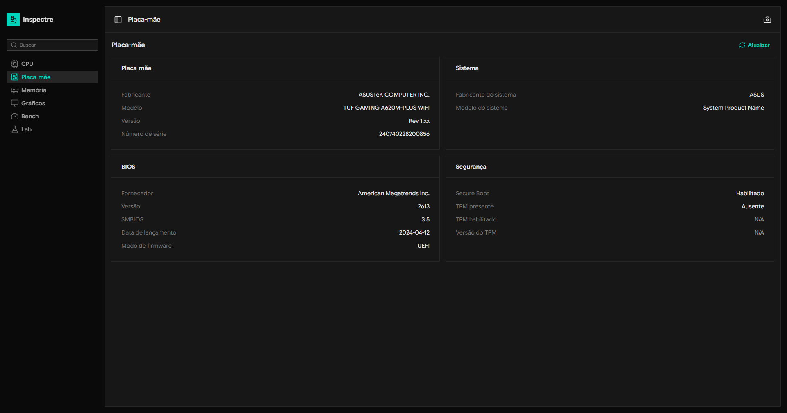

# Inspectre

Inspeção de hardware no Windows. Reimplementação livre do CPU-Z em Tauri 2, Rust e Vue 3.



## Download

Baixe a versão mais recente na [página de Releases](https://github.com/oGabrielSilva/inspectre/releases/latest).

| Plataforma   | Arquivo                            |
| ------------ | ---------------------------------- |
| Windows x64  | `Inspectre_x.y.z_x64-setup.exe`    |
| Windows x64  | `Inspectre_x.y.z_x64.msi`          |
| Windows ARM64 | `Inspectre_x.y.z_arm64-setup.exe` |
| Windows ARM64 | `Inspectre_x.y.z_arm64.msi`       |
| Linux (deb)  | `inspectre_x.y.z_amd64.deb`        |
| Linux (rpm)  | `inspectre-x.y.z-1.x86_64.rpm`     |
| Linux        | `inspectre_x.y.z_amd64.AppImage`   |

Binário não assinado. Na primeira execução no Windows aparece o aviso "Windows protegeu seu PC". Clique em **Mais informações** e depois em **Executar mesmo assim**.

## Features

- **CPU**: modelo, fabricante, núcleos físicos e lógicos, cache L1/L2/L3, instruction sets, frequência atual ao vivo via Tauri event channel (sem polling do frontend).
- **Placa-mãe**: fabricante, modelo, BIOS, UEFI vs BIOS legado, Secure Boot, TPM.
- **Memória**: slots, módulos por slot (tipo, velocidade, fabricante, part number), configuração de canais, uso ao vivo.
- **Gráficos**: adaptadores DXGI, memória dedicada e compartilhada, driver, resolução atual.
- **Bench**: SHA-256, AES-256 e crivo de Eratóstenes em single e multi-thread (`rayon` scope), com fator de escalabilidade.
- **Captura integrada**: print do conteúdo da janela direto do app, salvo onde você escolher, sem chrome do Windows na imagem.



## Stack

- **Tauri 2**: shell desktop sem Electron.
- **Rust**: probes de hardware (`wmi`, `windows-rs` para DXGI, `raw-cpuid`, `sysinfo`, `rayon` para o bench).
- **Vue 3 + TypeScript**: UI.
- **Nuxt UI 4 + Tailwind 4**: design system.
- **vue-i18n**: pt-BR como idioma primário.
- **ts-rs**: gera tipos TypeScript a partir dos `struct` Rust durante `cargo test`, sem duplicação manual.

## Por quê

Estudo de Tauri com nostalgia de CPU-Z. Aproveitei pra escrever probes reais de hardware via WMI, DXGI e CPUID, sem simular dado nenhum. O nome é trocadilho com `inspect` + `Spectre`, a vulnerabilidade de CPU famosa de 2018.

## Status

Versão atual: `v0.1.0`. Plataforma alvo: Windows 11. Linux e macOS têm esqueleto cross-platform pronto (captura de tela e probes abstraídos), com implementações nativas no roadmap.

## Limitações

Sensores de temperatura aparecem como `N/A` na maioria dos PCs. Inspectre roda 100% em user-mode e depende do que o Windows expõe via WMI (`MSAcpi_ThermalZoneTemperature` no namespace `root\WMI`), que raramente está disponível em desktops consumer. Apps como CPU-Z, HWiNFO64 e AIDA64 instalam driver kernel `.sys` assinado para ler MSRs e o chip Super I/O em ring 0. Adicionar driver próprio é decisão consciente de versão futura, com tradeoff de assinatura EV ou bundle de driver de terceiros (LibreHardwareMonitor).

## Build do código

Pré-requisitos: Rust 1.77+, Node 18+, Yarn, e o WebView2 Runtime (vem com Windows 11).

```bash
yarn install
yarn tauri dev
```

Build de release:

```bash
yarn tauri build
```

Os bundles ficam em `src-tauri/target/release/bundle/`.

## Estrutura

```
src/                       Frontend Vue 3
  components/ui/App*.vue   Wrappers semânticos sobre Nuxt UI (API pública de UI)
  components/features/     UI específica de cada aba
  composables/             useFeedback, useHardwareProbe
  i18n/locales/pt-BR/      Traduções por feature
  shared/generated/        Tipos gerados por ts-rs (não editar à mão)

src-tauri/
  src/commands/            Borda Tauri por domínio
  src/probes/              Probes de hardware por domínio
  src/error.rs             Enum InspectreError com serde tag "code"
```

## Licença

[MIT](LICENSE).
